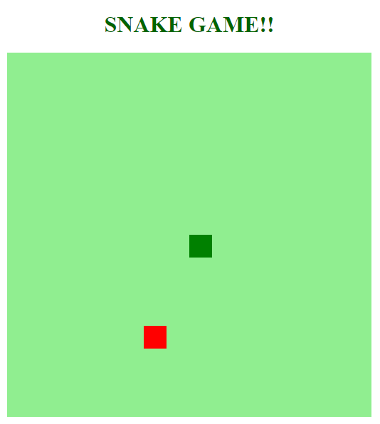
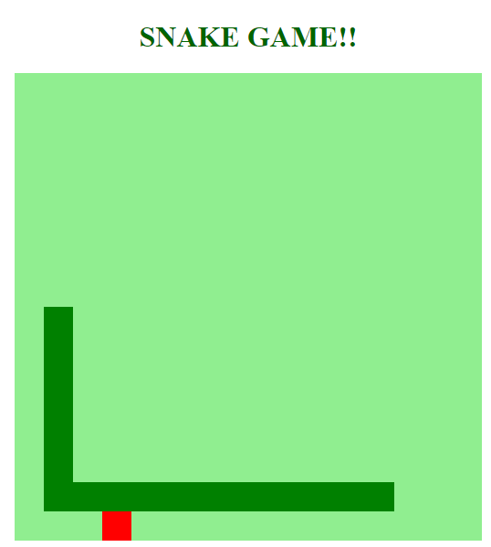

# Jogo vintage da cobrinha desenvolvido no bootcamp Javascript game Developer na plataforma Digital Innovation One.

## O projeto foi desenvolvido utilizando HTML, CSS e Javascript.

A comida da cobra é gerada de maneira aletória dentro da div usando Math.random e associada a uma posição em x e y.

A cobrinha é um array com posição x e y sendo que a posição 0 do array represanta da cabeça da cobra. 

A movimentação é feita conforme o evento de keydown e para cada posição é somado uma unidade de movimentação para a cabeça da cobra. 

